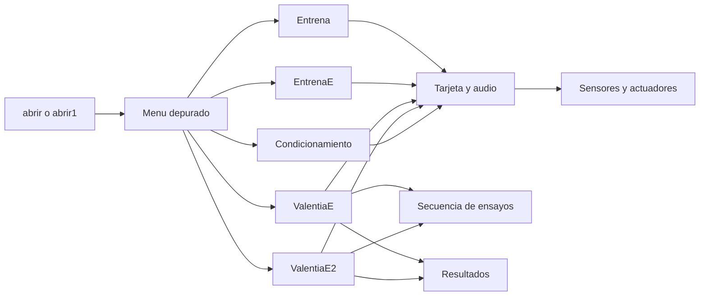
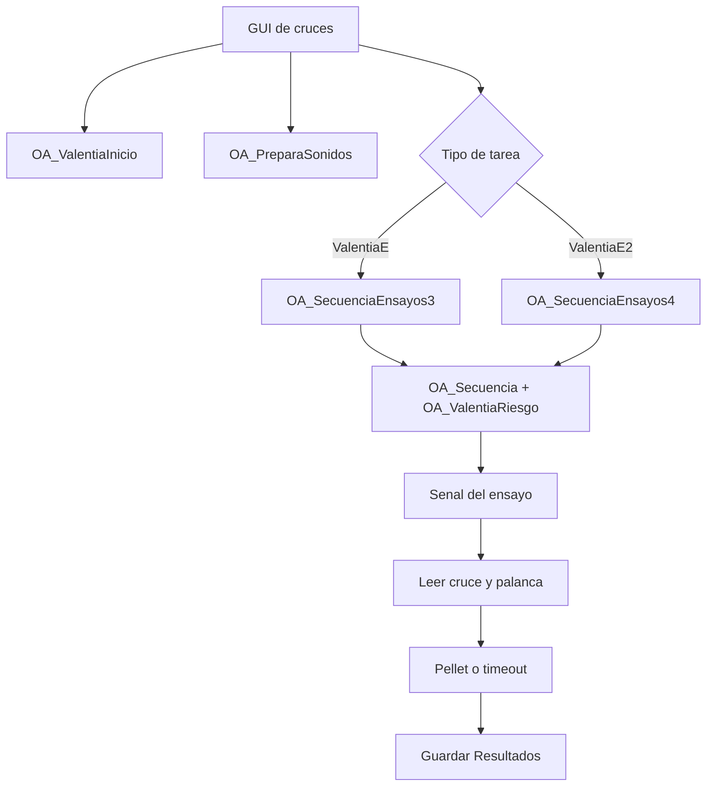

# Mapa Del MATLAB Limpio

Alcance: la copia estable desplegada en `C:\Users\Alberto\Desktop\CajaValentia`.

## Lectura Rapida

El menu elige una tarea. La tarea abre una GUI, prepara tarjeta y audio, corre
ensayos y usa funciones pequenas para leer sensores o activar la caja.

## Menu Y Tareas

| Opcion visible | Archivo principal | Que hace |
|---|---|---|
| Entrena | `Valentia/OA_ValentiaEntrenaPalancasCP.m` | Moldeamiento: palanca entrega comida. |
| EntrenaE | `OA_ValentiaEntrenaPalancasCPE.m` | Luz-comida: con luz hay comida; sin luz no. |
| ValentiaE | `OA_ValentiaCuatroE.m` | Cruces seguros, discriminacion o prueba. |
| ValentiaE2 | `OA_ValentiaCuatroE2.m` | Cruces peligrosos. |
| Condicionamiento | `OA_Condiciona_Aleatorio.m` | Ruido/LED y descarga aleatoria. |

`abrir.m` solo llama a `abrir1.m`. `abrir1.m` prepara las rutas correctas del
instalacion desplegada y muestra estas cinco opciones.

## Flujo De Un Ensayo De Cruce

Aplica a `ValentiaE` y `ValentiaE2`.

## Modulos Compartidos

| Grupo | Archivos principales | Funcion simple |
|---|---|---|
| Rutas de la instalacion | `cmc_root`, `cmc_setup_paths`, `cmc_state_dir`, `cmc_results_dir` | Evitan depender de carpetas viejas del disco C. |
| Tarjeta | `OA_ValentiaInicio`, `escribePto` | Conectan MATLAB con la tarjeta NI y escriben sus salidas. |
| Audio | `OA_PreparaSonidos`, `OA_Sonidos` | Preparan y reproducen tono o ruido por los dos canales. |
| Ensayos | `OA_Secuencia`, `OA_SecuenciaEnsayos3`, `OA_SecuenciaEnsayos4`, `OA_ValentiaRiesgo` | Deciden lado y si el ensayo es seguro o de riesgo. |
| Lectura | `OA_ValentiaBuscaIzquierda`, `OA_ValentiaBuscaDerecha`, `OA_ValentiaRevisaPalanca` | Detectan cruce y palanqueo. |
| Accion | `OA_ValentiaEstimuloI/D`, `OA_ValentiaRecompensaI/D`, `OA_ValentiaElectrico`, `OA_ValentiaPalanca`, `OA_ValentiaResetPalancas` | Encienden estimulos, dan comida, activan/apagan descarga y controlan palancas. |

## Para Cambiar Algo Sin Perderse

| Quiero cambiar... | Primer lugar que revisar |
|---|---|
| Una opcion del menu | `abrir1.m` |
| Luz-comida | `OA_ValentiaEntrenaPalancasCPE.m` |
| Regla de cruces seguros/riesgo | `OA_ValentiaCuatroE.m` |
| Regla de cruces peligrosos | `OA_ValentiaCuatroE2.m` |
| Orden/proporcion de ensayos | `OA_SecuenciaEnsayos3.m` o `OA_SecuenciaEnsayos4.m` |
| Sonido sin tocar luces | GUI de la tarea + `OA_Sonidos.m` |
| Luces, comida, descarga o sensores | Funcion de bajo nivel correspondiente; revisar primero el mapa de hardware. |

## Limite Importante

`OA_ValentiaInicio` no decide la conducta: solo abre la tarjeta `Dev2`. No se
debe tocar para cambiar una regla experimental. Las GUIs contienen callbacks
(acciones de botones); el inventario enlazado abajo lista los archivos que
realmente importan, no cada callback interno.

Siguiente lectura: [Inventario de modulos](02_inventario_modulos_matlab_limpio.md).
