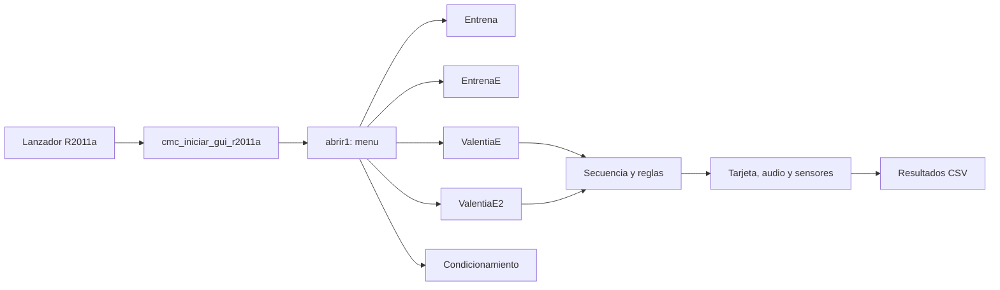

# Mapa Del Runtime MATLAB

> Nota de estado: este mapa conserva la arquitectura y rutas generales, pero
> sus referencias a un CSV principal, `cmc_cuenta_ensayo_cruce` y resultados de
> 10 columnas pertenecen a una rama experimental retirada. Para el runtime de
> `main`, usar [comportamiento actual](../current-runtime-behavior-and-known-limitations.md).

Alcance: `matlab/`, el runtime autocontenido que se despliega en la PC del
laboratorio. No describe `legacy/`, que es un archivo de auditoria.

## Idea En Un Vistazo

El lanzador diario llama `cmc_iniciar_gui_r2011a`. Esta funcion limpia el path
de MATLAB, carga solo `matlab/`, `matlab/Valentia/` y
`matlab/Valentia/valentia/`, y despues abre `abrir1`. Es la proteccion contra
menus y funciones viejas que siguen instalados en la PC.

## Tareas Del Menu

| Opcion | Archivo principal | Funcion |
| --- | --- | --- |
| Entrena | `Valentia/OA_ValentiaEntrenaPalancasCP.m` | Moldeamiento por palanca. |
| EntrenaE | `OA_ValentiaEntrenaPalancasCPE.m` | Luz-comida. |
| ValentiaE | `OA_ValentiaCuatroE.m` | Cruces seguros, discriminacion y prueba. |
| ValentiaE2 | `OA_ValentiaCuatroE2.m` | Cruces peligrosos. |
| Condicionamiento aleatorio | `OA_Condiciona_Aleatorio.m` | Ruido/LED y descarga aleatoria. |

## Como Leer Un Archivo GUIDE

En esta version antigua de MATLAB, un `.fig` es el dibujo de una ventana y el
`.m` con el mismo nombre contiene sus reglas. Un *callback* es el bloque que
corre al pulsar un boton. `handles` es la estructura que una GUI usa para
guardar conexiones de tarjeta/audio y referencias a sus controles.

Para una primera lectura de un `.m`: revisar el nombre de la funcion, las
llamadas a otras funciones, los `load`/`save` y despues los `..._Callback`.
No hace falta entender cada linea para localizar una regla experimental.

## Capas Compartidas

| Capa | Archivos principales | Responsabilidad |
| --- | --- | --- |
| Arranque y rutas | `cmc_iniciar_gui_r2011a`, `cmc_prepara_entorno_r2011a`, `abrir1`, `cmc_root`, `cmc_setup_paths` | Aislar esta copia y abrir el menu. |
| Tarjeta NI | `OA_ValentiaInicio`, `escribePto` | Abrir `Dev2` y escribir lineas digitales. |
| Audio | `OA_PreparaSonidos`, `OA_Sonidos`, `OA_FinSonidos` | Preparar salida estereo y generar sonido. |
| Secuencia | `OA_Secuencia`, `OA_SecuenciaEnsayos3/4`, `OA_ValentiaRiesgo`, `OA_SecuenciaDiscriminacionSonidoSolo` | Elegir lados, riesgo y tipo de evento. |
| Sensores | `OA_ValentiaBuscaIzquierda/Derecha`, `OA_ValentiaRevisaPalanca`, `cmc_lee_zona_posicion` | Leer posicion y palanqueos. |
| Acciones | `OA_ValentiaEstimuloI/D`, `OA_ValentiaRecompensaI/D`, `OA_ValentiaElectrico`, `OA_ValentiaPalanca` | Luces, pellet, parrilla y palancas. |
| Resultados | `cmc_*csv*`, `cmc_cuenta_ensayo_cruce`, `cmc_registrar_palanqueos` | Tabla y los dos CSV de sesion. |

`OA_ValentiaInicio` no decide conducta: solo conecta la tarjeta. Las reglas
experimentales viven primero en la GUI de la tarea y sus funciones de
secuencia; las funciones de bajo nivel solo ejecutan ordenes fisicas.

## Rutas Para Cambios Comunes

| Quiero cambiar | Empezar por |
| --- | --- |
| Opcion del menu o aislamiento de rutas | `cmc_iniciar_gui_r2011a.m`, `abrir1.m` |
| Discriminacion | `OA_ValentiaCuatroE.m` y `architecture/04_backend_valentiae_aleatorizacion.md` |
| Cruces Peligrosos | `OA_ValentiaCuatroE2.m` y `architecture/06_cambios_reutilizables_discriminacion_a_cp.md` |
| Orden/proporcion de riesgo | `Valentia/OA_SecuenciaEnsayos3.m` o `OA_SecuenciaEnsayos4.m` |
| Sonido sin luz de comida | GUI de tarea, `OA_Sonidos.m` y su secuencia especifica |
| Luces, pellet, parrilla o sensores | Funcion de bajo nivel correspondiente y `../hardware-io.md` |
| Formato de datos | `cmc_escribir_csv_resultados.m` y `cmc_escribir_csv_palanqueos.m` |

## Archivos De Estado Y Resultados

Los `.mat` de `matlab/Valentia/` guardan defaults o estado temporal de GUIDE.
No son resultados finales. Cada sesion debe exportar `nombre.csv` (10 columnas
por evento) y `nombre_palanqueos.csv` (una fila por presion). Ver
[`06_cambios_reutilizables_discriminacion_a_cp.md`](06_cambios_reutilizables_discriminacion_a_cp.md)
para sus reglas vigentes.

## Limite Tecnico

El runtime de caja usa R2011a, GUIDE, la API DAQ antigua y audio Windows. La
migracion a MATLAB moderno es una linea separada: no se debe probar hardware
moderno mezclando cambios con `main`.
